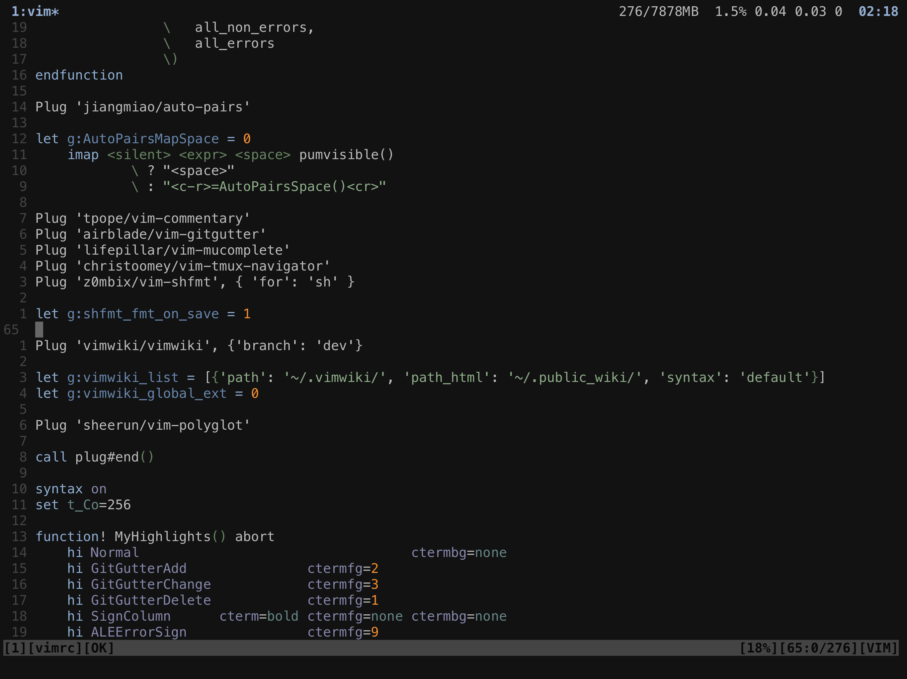

# VIM settings

My VIM settings. I'm sharing them but remember that it's better to configure each aspect of VIM to your liking and habits.

It uses excellent [Apprentice](https://github.com/romainl/Apprentice) color scheme created by [romainl](https://github.com/romainl).

### Plugins:

- [pangloss/vim-javascript](https://github.com/pangloss/vim-javascript)
- [leafgarland/typescript-vim](https://github.com/leafgarland/typescript-vim)
- [peitalin/vim-jsx-typescript](https://github.com/peitalin/vim-jsx-typescript)
- [styled-components/vim-styled-components](https://github.com/styled-components/vim-styled-components)
- [fatih/vim-go](https://github.com/fatih/vim-go)
- [ojroques/vim-oscyank](https://github.com/ojroques/vim-oscyank)
- [dense-analysis/ale](https://github.com/dense-analysis/ale)
- [jiangmiao/auto-pairs](https://github.com/jiangmiao/auto-pairs)
- [tpope/vim-commentary](https://github.com/tpope/vim-commentary)
- [airblade/vim-gitgutter](https://github.com/airblade/vim-gitgutter)
- [lifepillar/vim-mucomplete](https://github.com/lifepillar/vim-mucomplete)
- [christoomey/vim-tmux-navigator](https://github.com/christoomey/vim-tmux-navigator)
- [z0mbix/vim-shfmt](https://github.com/z0mbix/vim-shfmt)
- [vimwiki/vimwiki](https://github.com/vimwiki/vimwiki)
- [sheerun/vim-polyglot](https://github.com/sheerun/vim-polyglot)
