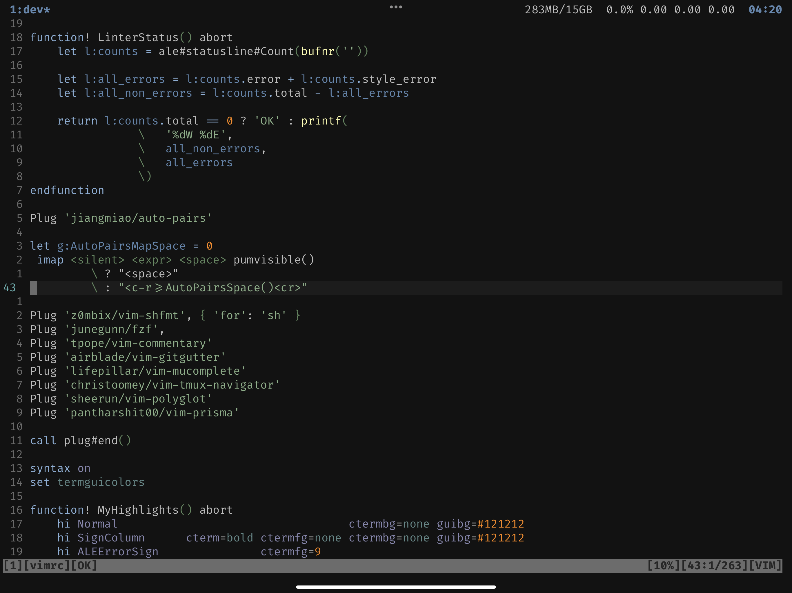

# VIM settings

My VIM settings. I'm sharing them but remember that it's better to configure each aspect of VIM to your liking and habits.

It uses excellent [Apprentice](https://github.com/romainl/Apprentice) color scheme created by [romainl](https://github.com/romainl).
